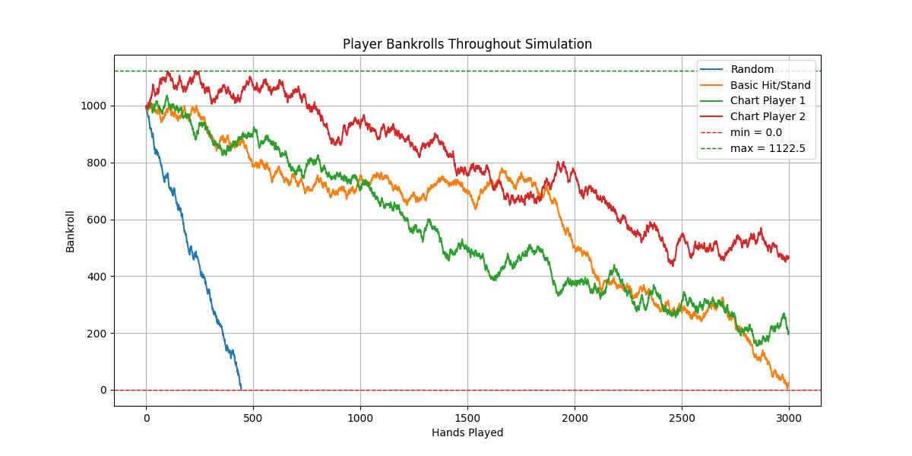
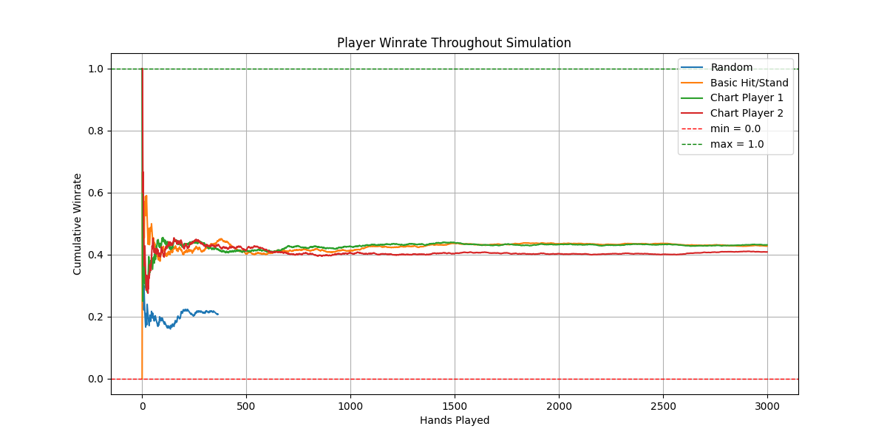
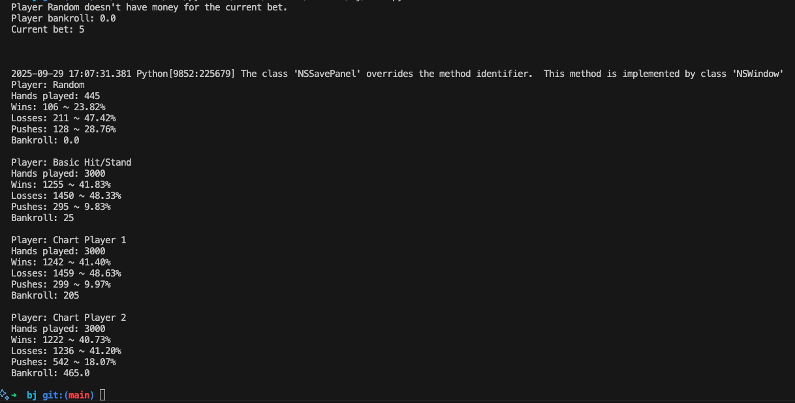
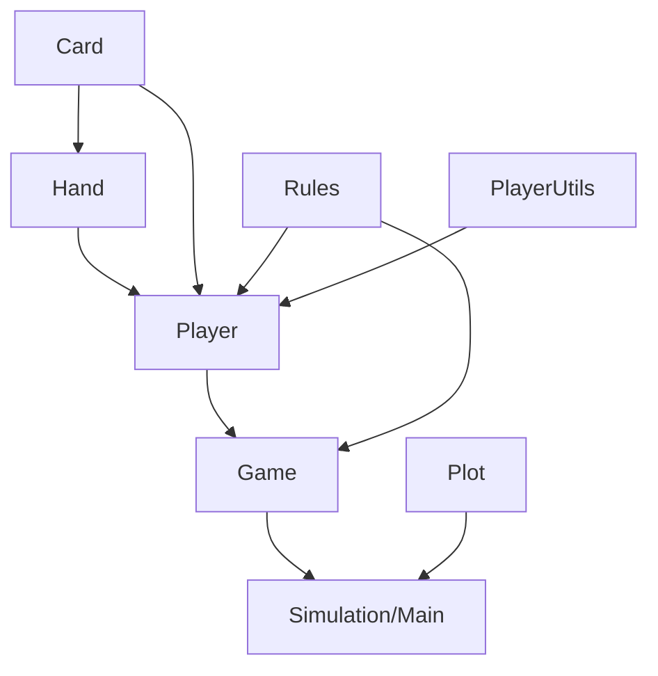

# Blackjack Simulator 🃏

A simple blackjack simulator designed to test various strategies and house rules. This project allows you to simulate games, analyze outcomes, and explore different player strategies.

---

### 📋 Rules
The game supports configurable house rules, including number of decks, dealer rules, payouts, etc.

Current options:
* **HouseRules**: Basic rules used in most casinos.

---

### 🎯 Players
Players only make decisions, including hit, stand, double, or surrender based on their strategy.

Current options:
* **Random Player**: Makes decisions randomly.
* **Basic Strategy Player**: Simple hit/stand logic.
* **Chart Player 1**: Follows a basic strategy chart.
* **Chart Player 2**: Follows an advanced strategy chart.

---

### 📂 Files

- **`main.py`**: Entry point for running custom number of rounds and betting amounts with selected players and rules.
- **`plot.py`**: Visualization of results and trends from simulations.

**/src**:
- **`card.py`**: Creates and shuffles the dec.
- **`hand.py`**: Calculates totals, checks busts, blackjacks, etc.
- **`rules.py`**: Contains different rule sets.
- **`player.py`**: Contains different players.
- **`player_utils.py`**: Provides utility functions and matrices for players.
- **`game.py`**: Manages the flow of a single round of blackjack.

---

### 🔀 Flowchart

---

### ▶️ How to Run
1. Clone the repository.
2. Adjust `PARAMETERS` in `main.py`.
2. Run `main.py`.

---

### 🚀 Future Work
- Implement splitting.
- Expand rule customization options.
- Implement card-counting and AI-based strategies.
- Add more detailed statistical analysis of outcomes.
